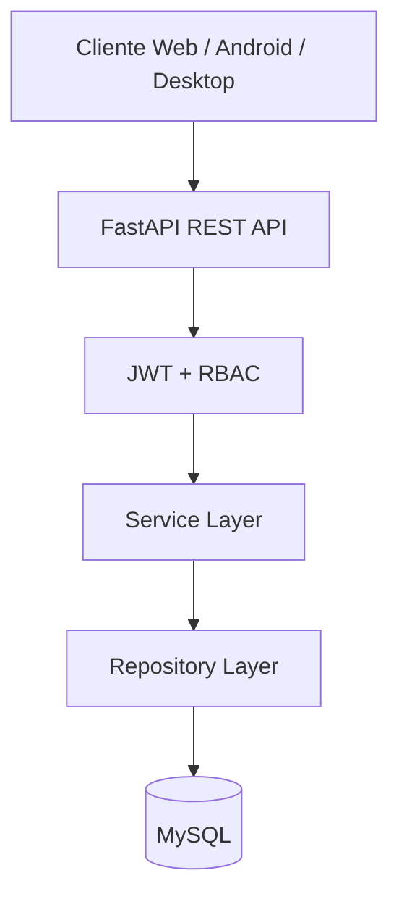
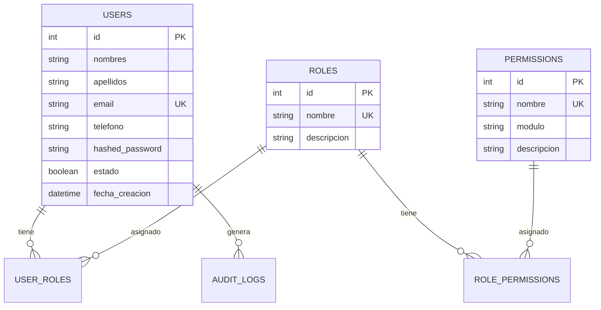

# FastFood Platform - Backend

API REST para plataforma de gestión y venta de comida rápida.

## Stack

- Python 3.11+
- FastAPI
- SQLAlchemy 2.x
- MySQL (XAMPP)
- Alembic
- JWT + Bcrypt
- RBAC (Roles y Permisos)

## Estructura

```text
backend/
├── app/
│   ├── core/           # Configuración, DB, dependencias
│   ├── models/         # Modelos SQLAlchemy
│   ├── schemas/        # Esquemas Pydantic
│   ├── repositories/   # Capa de acceso a datos
│   ├── services/       # Lógica de negocio
│   ├── routes/         # Endpoints REST
│   ├── security/       # JWT, bcrypt, sanitización
│   ├── permissions/    # RBAC
│   ├── middleware/     # Headers de seguridad
│   ├── seeders/        # Datos iniciales
│   ├── domains/        # (Fase 2) Dominios de negocio
│   ├── modules/        # (Fase 2) Módulos extendidos
│   └── tests/
├── database/
│   └── schema.sql
├── migrations/
├── uploads/
├── main.py
└── requirements.txt
```

## Requisitos previos

1. XAMPP con MySQL activo
2. Python 3.11+

## Instalación

```powershell
cd backend
python -m venv venv
.\venv\Scripts\Activate.ps1
pip install -r requirements.txt
copy .env.example .env
```

Editar `.env` con credenciales MySQL (XAMPP: user `root`, password vacía).

## Migraciones (Alembic) — flujo oficial

Las tablas **solo** se crean con Alembic (no con `create_all`). Al arrancar, la API verifica que la BD esté en `head`.

### Instalación completa (recomendado)

```powershell
cd backend
.\scripts\migrate.ps1          # Crea BD + alembic upgrade head + seeders
```

O con Python:

```powershell
python scripts/migrate.py setup
```

### Comandos individuales

| Comando | Descripción |
|---------|-------------|
| `.\scripts\migrate.ps1 -Upgrade` | `alembic upgrade head` |
| `.\scripts\migrate.ps1 -Seed` | Datos iniciales (admin, productos demo) |
| `.\scripts\migrate.ps1 -ShowCurrent` | Ver revisión aplicada |
| `python scripts/migrate.py history` | Historial de migraciones |
| `python scripts/migrate.py downgrade -1` | Revertir última migración |

### Cadena de migraciones

```text
001_initial  → Auth (users, roles, permissions, audit_logs)
002_catalog  → categories, products, inventory_movements
003_commerce → carts, orders, purchases
004_billing  → payments, invoices, tickets  ← head
```

### Solo crear la base de datos (sin tablas)

```powershell
C:\xampp\mysql\bin\mysql.exe -u root < database/init.sql
alembic upgrade head
python -m app.seeders.run_seeders
```

Referencia SQL completa (manual): `database/schema.sql`

## Ejecutar servidor

```powershell
uvicorn main:app --reload --host 0.0.0.0 --port 8000
```

- Swagger: http://localhost:8000/docs
- ReDoc: http://localhost:8000/redoc
- Health: http://localhost:8000/api/v1/health

## Credenciales iniciales (Seeder)

| Campo      | Valor            |
|------------|------------------|
| Email      | admin@admin.com  |
| Contraseña | Admin123*        |

El seeder se ejecuta automáticamente al iniciar la aplicación.

## Endpoints principales (Fase 1 - Auth)

| Método | Ruta                        | Descripción              |
|--------|-----------------------------|--------------------------|
| POST   | /api/v1/auth/login          | Inicio de sesión         |
| POST   | /api/v1/auth/register       | Registro cliente         |
| POST   | /api/v1/auth/refresh        | Renovar token            |
| GET    | /api/v1/auth/me             | Perfil autenticado       |
| POST   | /api/v1/auth/change-password| Cambiar contraseña       |
| CRUD   | /api/v1/users               | Gestión de usuarios      |
| CRUD   | /api/v1/roles               | Gestión de roles         |
| CRUD   | /api/v1/permissions         | Gestión de permisos      |

## Endpoints principales (Fase 2 - Catálogo e Inventario)

| Método | Ruta                              | Descripción                    |
|--------|-----------------------------------|--------------------------------|
| GET    | /api/v1/products/public           | Catálogo público (sin auth)    |
| CRUD   | /api/v1/categories                | Gestión de categorías          |
| CRUD   | /api/v1/products                  | Gestión de productos           |
| GET    | /api/v1/products/low-stock        | Productos con stock bajo       |
| PATCH  | /api/v1/products/{id}/activate    | Activar producto               |
| PATCH  | /api/v1/products/{id}/deactivate  | Desactivar producto            |
| POST   | /api/v1/products/{id}/imagen      | Subir imagen (JPG/PNG)         |
| CRUD   | /api/v1/inventory/movements       | Entradas/salidas de inventario |

### Productos demo (Seeder)

- Hamburguesa Clásica, Hamburguesa BBQ, Papas Fritas, Malteada de Vainilla, Combo Familiar
- Categorías: Hamburguesas, Bebidas, Combos, Postres

## Endpoints principales (Fase 3 - Pedidos, Carrito y Compras)

| Método | Ruta                           | Descripción                          |
|--------|--------------------------------|--------------------------------------|
| GET    | /api/v1/cart                   | Ver mi carrito + total               |
| POST   | /api/v1/cart/items             | Agregar producto                     |
| PUT    | /api/v1/cart/items/{product_id}| Modificar cantidad                   |
| DELETE | /api/v1/cart/items/{product_id}| Eliminar producto del carrito        |
| DELETE | /api/v1/cart/clear             | Vaciar carrito                       |
| POST   | /api/v1/orders/checkout        | Crear pedido desde carrito           |
| GET    | /api/v1/orders                 | Listar pedidos (propio o todos admin)|
| GET    | /api/v1/orders/{id}            | Detalle de pedido                    |
| PATCH  | /api/v1/orders/{id}/status     | Cambiar estado del pedido            |
| DELETE | /api/v1/orders/{id}            | Eliminar pedido                      |
| GET    | /api/v1/purchases              | Historial de compras                 |
| GET    | /api/v1/purchases/{id}         | Detalle de compra                    |

### Estados del pedido

`pendiente` → `pagado` → `verificado` → `preparando` → `listo` → `entregado`

También: `cancelado` (desde estados permitidos). Al marcar como **pagado** se descuenta stock, se registra la compra y movimiento de inventario.

## Endpoints principales (Fase 4 - Pagos, Facturación y Tickets)

| Método | Ruta                              | Descripción                         |
|--------|-----------------------------------|-------------------------------------|
| POST   | /api/v1/payments/orders/{id}      | Subir comprobante (JPG/PNG/PDF)     |
| GET    | /api/v1/payments                  | Listar pagos                        |
| GET    | /api/v1/payments/pending          | Pagos pendientes (admin)            |
| POST   | /api/v1/payments/{id}/approve     | Aprobar pago → factura + ticket     |
| POST   | /api/v1/payments/{id}/reject      | Rechazar pago                       |
| GET    | /api/v1/invoices                  | Historial de facturas               |
| GET    | /api/v1/invoices/{id}/pdf         | Descargar factura PDF               |
| GET    | /api/v1/tickets                   | Historial de tickets                |
| GET    | /api/v1/tickets/{id}/pdf          | Descargar ticket PDF                |

### Flujo de pago por transferencia

1. Cliente hace checkout → pedido `pendiente`
2. Cliente sube comprobante → pago `pendiente`
3. Admin aprueba → pedido `pagado`, stock descontado, compra registrada, factura y ticket PDF generados
4. Admin rechaza → pedido sigue `pendiente`, cliente puede reenviar comprobante

## Seguridad OWASP

- JWT con access + refresh tokens
- Bcrypt para hash de contraseñas
- Validación de fortaleza de contraseña
- Sanitización XSS en entradas de texto
- Rate limiting (SlowAPI)
- CORS configurable
- Headers de seguridad HTTP
- Logs de auditoría
- Protección SQL Injection vía SQLAlchemy ORM
- RBAC granular por módulo

## Tests

```powershell
pytest -v
```

## Diagrama de arquitectura



## Diagrama ER (Fase 1 - Auth)



## Próximas fases

- Dashboard administrador (ventas, KPIs, inventario bajo)
- Frontend React + TypeScript (página estilo Rappi)
